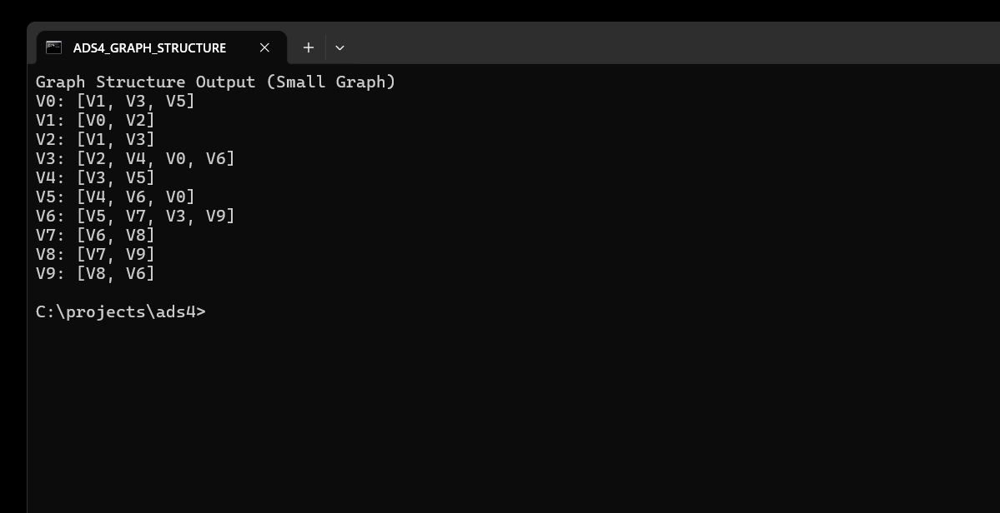
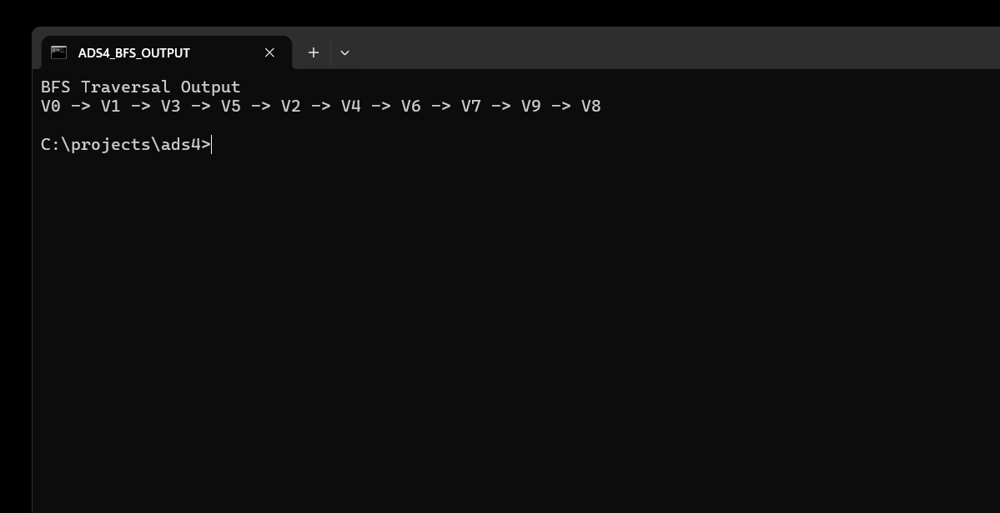
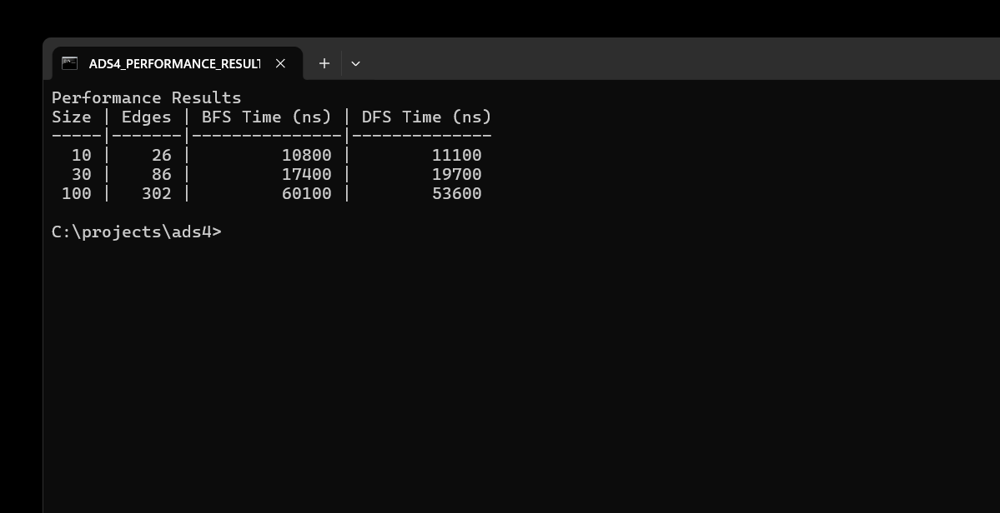

# Assignment 4: Graph Traversal and Representation System

This project implements the assignment in **Python** as requested. It keeps the required object-oriented structure from the assignment: `Vertex`, `Edge`, `Graph`, `Experiment`, and `main`.

## Project Overview

The program represents a graph with vertices and edges. A vertex is a node with a unique id, and an edge is a connection between two vertices. The graph uses an adjacency list, where each vertex id stores a list of its neighboring vertex ids.

The project implements two graph traversal algorithms:

- **Breadth-First Search (BFS)**: visits vertices level by level.
- **Depth-First Search (DFS)**: visits one branch deeply before backtracking.

The experiment creates three graph sizes:

- Small: 10 vertices
- Medium: 30 vertices
- Large: 100 vertices

## Repository Structure

```text
ads4/
├── src/
│   ├── vertex.py
│   ├── edge.py
│   ├── graph.py
│   ├── experiment.py
│   └── main.py
├── docs/
│   ├── run_output.txt
│   └── screenshots/
├── README.md
└── .gitignore
```

## Class Descriptions

### Vertex

`Vertex` represents one graph node. It stores a unique integer id and provides a readable string format such as `V0`.

### Edge

`Edge` represents a connection between two vertices. It stores the source vertex and destination vertex.

### Graph

`Graph` stores all vertices and edges using an adjacency list. It supports:

- `add_vertex(vertex)`
- `add_edge(from_id, to_id)`
- `print_graph()`
- `bfs(start_id)`
- `dfs(start_id)`

The current implementation builds undirected graphs, so every added edge is stored in both directions.

### Experiment

`Experiment` creates test graphs, runs BFS and DFS, measures execution time in nanoseconds using `perf_counter_ns()`, and prints a comparison table.

## Algorithm Descriptions

### BFS

BFS starts at a selected vertex, puts it in a queue, and repeatedly visits the next vertex from the front of the queue. Each unvisited neighbor is added to the queue.

Use cases:

- Finding shortest paths in unweighted graphs
- Level-order exploration
- Checking nearby nodes first

Time complexity: **O(V + E)**, where `V` is the number of vertices and `E` is the number of edges.

### DFS

DFS starts at a selected vertex and recursively visits each unvisited neighbor. It follows one path as far as possible before returning to try another path.

Use cases:

- Path finding
- Cycle detection
- Topological sorting
- Exploring connected components

Time complexity: **O(V + E)**.

## Experimental Results

Results from the real run saved in `docs/run_output.txt`:

| Vertices | Edges | BFS Time (ns) | DFS Time (ns) |
|---:|---:|---:|---:|
| 10 | 26 | 10800 | 11100 |
| 30 | 86 | 17400 | 19700 |
| 100 | 302 | 60100 | 53600 |

## Screenshots

### Graph Structure Output



### BFS Traversal Output



### DFS Traversal Output


### Performance Results



## Analysis Questions

### How does graph size affect BFS and DFS performance?

As the graph grows from 10 to 100 vertices, both BFS and DFS take more time. This is expected because both algorithms must visit reachable vertices and inspect their edges.

### Which traversal is faster in your experiments?

BFS was faster for the 10-vertex and 30-vertex graphs in this run, while DFS was faster for the 100-vertex graph. The difference is small and depends on graph structure, Python runtime behavior, and measurement noise.

### Do results match the expected complexity O(V + E)?

Yes. The running time increases as the number of vertices and edges increases. This matches the expected **O(V + E)** behavior for both BFS and DFS.

### How does graph structure affect traversal order?

Traversal order depends on the adjacency list order. BFS visits closer neighbors first, while DFS follows the first available path deeply before returning.

### When is BFS preferred over DFS?

BFS is preferred when the goal is to find the shortest path in an unweighted graph or explore vertices by distance from the start.

### What are the limitations of DFS?

DFS can go very deep before finding a target. In recursive implementations, a very large graph may also hit recursion depth limits.

## Reflection

This assignment helped me understand how adjacency lists store graph relationships efficiently. Implementing both traversals showed that the same graph can be explored in very different orders depending on the algorithm.

BFS is more systematic for level-by-level searching, while DFS is simpler for deep exploration. The main challenge was keeping the graph structure clear while also producing readable output and measurable experiment results.

## How to Run

```bash
python src/main.py
```
